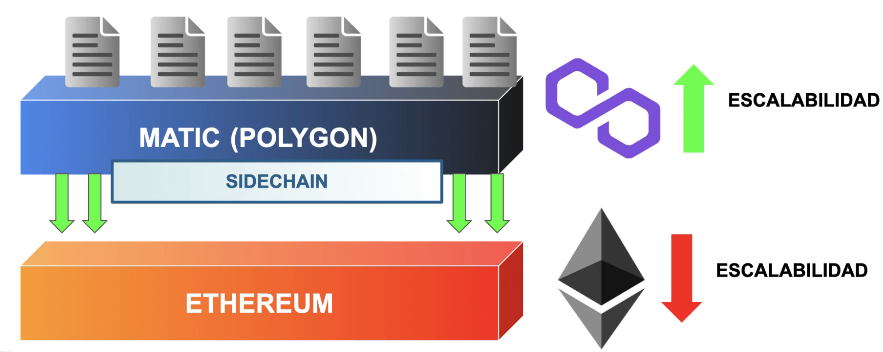
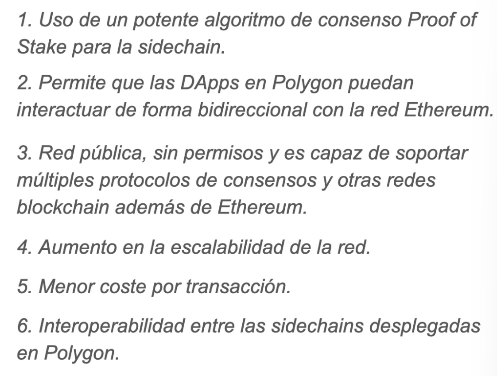

# POLYGON-[MATIC](https://polygon.tecnology)

Su principal función es permitir la escalabilidad en proyectos de Ethereum.
Uso de polygon como red de segunda capa sobre Ethereum. Su moneda es MATIC. Proof of Stake

Plasma: lading network

- PoS -> Staking, dueños prestan tokens para generar más bloques, en cambio, le devuelven más de dichos bloques o de otro tipo
- Solo se manda el hash de merkle de cada transaccion a un unico bloque para la red de ethereum. Se manda el Hash Root a Ethereum. En Ethereum registrar información no implica tanto coste como registrar una transacción.
- [POLYGON SDK](criptonoticias.com/tecnologia/polygon-lanza-sdk-implementar-cadenas-conectadas-ethereum/) Para implementar rápidamente cadenas conectadas a Ethereum
- 200 000 transacciones por segundo

## Referencias

- [PolyGon](https://polygon.tecnology)
- [Video curso](https://www.udemy.com/course/bootcamp-blockchain-cero-experto/learn/lecture/31586810#overview)
